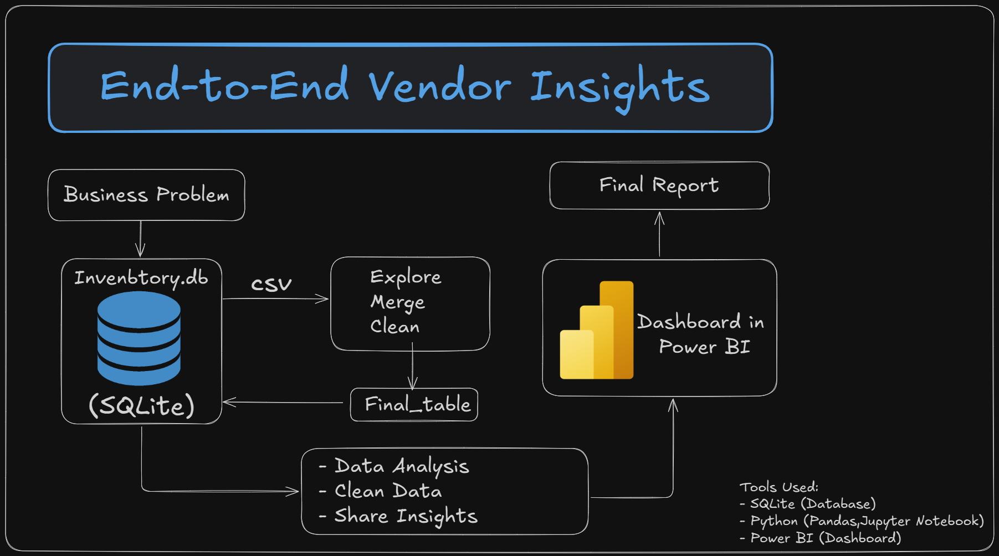
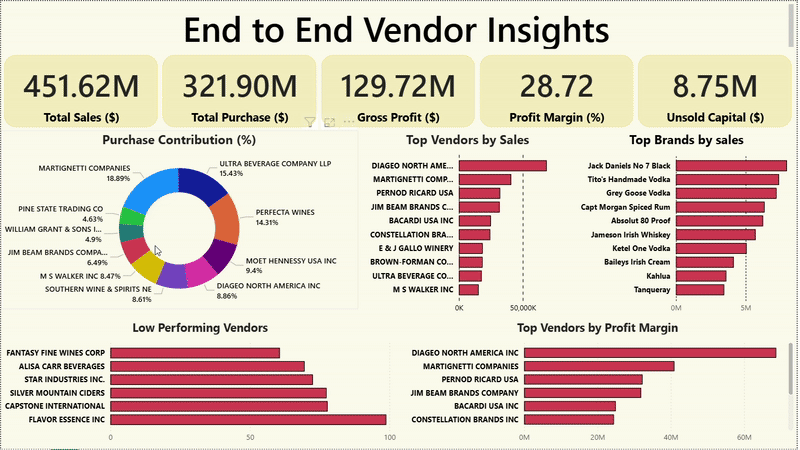

# Vendor Performance Data Analytics - End-to-End Project

[](https://python.org)
[](https://jupyter.org)
[](https://powerbi.microsoft.com)
[](https://sqlite.org)



## 📋 Problem Statement

This project analyzes vendor performance for a wholesale/retail business. The goal is to identify which vendors and brands are profitable, where pricing or inventory issues are hurting the business, and how to fix them using data-driven insights.

## 🎯 Project Objectives

- **Identify** top-performing and underperforming vendors
- **Highlight** slow-moving or stuck inventory
- **Detect** pricing inconsistencies and opportunities
- **Analyze** how bulk purchases affect profit margins
- **Answer** core business questions with clear, actionable data

## 💡 Why This Matters

Businesses constantly ask:
- Which vendors are boosting profits — and which are draining them?
- Where are we losing money — in pricing, inventory, or buying decisions?
- How can we optimize vendor relationships for maximum profitability?

This project tackles those questions head-on using comprehensive data analysis and interactive dashboards.

## 🔄 How It Works

### 1. **Data Ingestion** 📥
   Load CSVs into SQLite using Python with robust error handling and logging for large files.

### 2. **Data Cleaning & Analysis** 🧹
   Use SQL and Pandas to explore, join, and clean the data for accurate insights.

### 3. **Insight Generation** 💡
   Calculate key performance indicators (KPIs) like margins, sales trends, stuck inventory, and vendor-level performance metrics.

### 4. **Visualization** 📊
   Build an interactive Power BI dashboard that's user-friendly and ready for business stakeholders.

## 📊 Data Sources

- **Opening and closing inventory** - Stock levels and movement tracking
- **Vendor purchases and pricing** - Cost analysis and vendor performance
- **Product-level sales data** - Revenue and sales pattern analysis
- **Vendor invoice details** - Transaction-level insights

All datasets are consolidated into a single SQLite database for efficient querying and analysis.

## 📁 Project Structure

| File | Purpose | Description |
|------|---------|-------------|
| `Ingestion.ipynb` | Data Loading | Loads CSVs into SQLite with comprehensive logging and error handling |
| `Exploratory Data Analysis.ipynb` | Data Exploration | Cleans and explores data using Pandas and SQL |
| `Vendor perfomance.ipynb` | Performance Analysis | Analyzes vendor/brand-level performance metrics |
| `export_final_table.py` | Data Export | Python script to export processed data for Power BI |
| `PowerBI_Data_Dictionary.md` | Documentation | Comprehensive data dictionary for Power BI dashboard |
| `inventory.db` | Database | SQLite database containing all processed data |
| `final_table_for_powerbi.csv` | Power BI Data | Clean, merged dataset ready for Power BI visualization |
| `Workflow.png` | Documentation | Visual project workflow diagram |
| `Dashboard.gif` | Preview | Animated preview of the interactive Power BI dashboard |

## 💻 Code Examples

### Data Ingestion
```python
import pandas as pd
import sqlite3

# Connect to SQLite database
conn = sqlite3.connect('inventory.db')

# Load and store sales data
df = pd.read_csv('data/sales.csv')
df.to_sql('sales', conn, if_exists='replace', index=False)
```

### Data Cleaning & Merging
```python
# Load data from database
df_sales = pd.read_sql('SELECT * FROM sales', conn)
df_purchases = pd.read_sql('SELECT * FROM purchases', conn)

# Merge datasets
merged = pd.merge(df_sales, df_purchases, on='product_id', how='left')
merged = merged.dropna()
merged['date'] = pd.to_datetime(merged['date'])
```

### Performance Analysis
```python
# Calculate vendor performance metrics
vendor_sales = merged.groupby('vendor_name')['sales_amount'].sum().reset_index()
top_vendors = vendor_sales.sort_values(by='sales_amount', ascending=False).head(5)
```

### Export for Power BI
```python
# Export cleaned data for Power BI
merged.to_csv('final_table_for_powerbi.csv', index=False)
```

## 🛠️ Skills Demonstrated

- **SQL** - Complex joins, filtering, grouping, and aggregation
- **Python** - Scripting with logging, chunking, and comprehensive error handling
- **Pandas** - Advanced data wrangling and manipulation techniques
- **Power BI** - Interactive dashboard creation and data visualization
- **Data Engineering** - ETL processes and data pipeline development
- **Business Intelligence** - Translating business problems into data-driven solutions

## 📈 Dashboard Preview



Interactive Power BI dashboard featuring:
- Sales performance metrics
- Purchase analysis and trends
- Profit margin calculations
- Vendor health indicators
- Inventory movement tracking
- Real-time KPI monitoring

## 🚀 Getting Started

### Prerequisites
- Python 3.8+
- Jupyter Notebook
- Power BI Desktop (for visualization)

### Installation

1. **Clone the repository**
   ```bash
   git clone https://github.com/GoutamIITP/Vendor-Performance-Data-Analytics-End-To-End-Project.git
   cd Vendor-Performance-Data-Analytics-End-To-End-Project
   ```

2. **Install dependencies**
   ```bash
   pip install pandas numpy sqlite3 jupyter
   ```

3. **Launch Jupyter Notebook**
   ```bash
   jupyter notebook
   ```

4. **Run the notebooks in sequence:**
   - `Ingestion.ipynb` - Data loading and database setup
   - `Exploratory Data Analysis.ipynb` - Data exploration and cleaning
   - `Vendor perfomance.ipynb` - Performance analysis (optional deep dive)

5. **Open Power BI and connect to `final_table_for_powerbi.csv`**

## 📝 Data Dictionary

For detailed information about the data structure and fields, refer to [PowerBI_Data_Dictionary.md](PowerBI_Data_Dictionary.md).

## 🤝 Contributing

Contributions are welcome! Please feel free to submit a Pull Request.

## 📄 License

This project is open source and available under the [MIT License](LICENSE).

## 👨‍💻 Author

**Goutam IITP**
- GitHub: [@GoutamIITP](https://github.com/GoutamIITP)

---
 